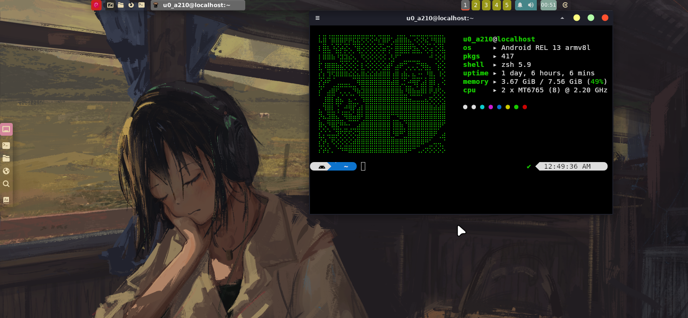

# My Xfce4 Config
This configs it's not 100% pure my creation

<p>

</p>

Here are some information about my setup:
- DE: Xfce4
- Terminal: kitty
- Shell: zsh
- Panel: Xfce4 Panel
- File Manager: Thunar
- Theme: Ant-Bloody
- Icons: Gruvbox-plus-icon-pack
- Fonts: JetBrains-Mono

Special credit to [LinuxDroidMaster](https://youtube.com/@linuxdroidmaster?si=55wgjCbNcLnxgWOH) for his installation guide and launch scripts 
[diws](https://youtube.com/@diws)
for his xfce4 rice guide and me for doing this ricing on termux. Also a huge thanks to guys/dev that develope the termux

---

### 🍂 Installation(termux)

```bash
cd $HOME
pkg upgrade -y
pkg update -y
pkg install git -y
pkg install wget
wget https://raw.githubusercontent.com/3324343/xfce4-conf/refs/heads/main/scripts/termux-setup.sh
chmod +x termux-setup.sh
bash termux-setup.sh
```
